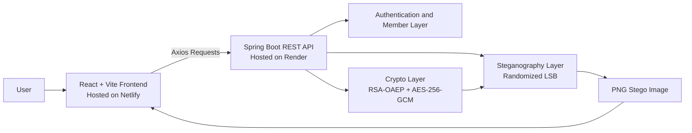

# StegaCrypt

StegaCrypt is a full-stack steganography web application that encrypts text and hides it inside images. It combines public-key cryptography, randomized LSB embedding, and a built-in secure chat workflow in one project.

The project was designed as a practical mini-project that brings together cryptography, secure communication, and image processing in a way that is easy to demonstrate from the browser. Instead of only showing a basic hide-and-extract flow, StegaCrypt also includes a secure chat experience where authenticated users can share stego images with specific recipients. That makes the project useful not just as a steganography demo, but as a complete proof-of-concept for confidential message exchange using images as the transport layer.

At the core of the system, the backend encrypts every message with a fresh AES session key, protects that key with RSA-OAEP, and embeds the encrypted payload into image pixels using a randomized LSB strategy. The frontend then exposes that workflow through a guided interface for embedding, extraction, key management, and secure member-to-member message sharing. The result is a project that demonstrates how modern encryption and steganography can be combined in a real full-stack application.

🌐 Live Demo

You can access the fully deployed StegaCrypt application here:
👉 https://stegacrpyt.netlify.app/

This live version allows you to:

Try real-time steganographic embedding and extraction
Experience the secure chat workflow
Test encryption + image-based message sharing directly from the browser

## Highlights

- RSA public/private key workflow for safer message sharing
- AES-256-GCM for message encryption with integrity protection
- RSA-OAEP wrapping for one-time AES session keys
- Randomized LSB steganography for image embedding
- Capacity checking before embedding
- Secure chat with login, registration, demo members, and recipient-based decryption
- React frontend and Spring Boot backend

## How It Works

### Embed

1. Upload a carrier image.
2. Generate or paste the recipient public key.
3. Encrypt the message with a fresh AES session key.
4. Wrap that key with RSA.
5. Embed the payload into the image and export a PNG stego file.

### Extract

1. Upload the stego image.
2. Provide the matching RSA private key or use the secure chat flow.
3. Rebuild the deterministic embedding path.
4. Recover and decrypt the hidden message.

## Tech Stack

- Frontend: React, Vite, CSS
- Backend: Spring Boot, Java 17, Maven
- Crypto: RSA-2048, RSA-OAEP, AES-256-GCM
- Image processing: randomized LSB steganography

## System Architecture



## Project Modules

- `frontend/` contains the full user interface for embedding, extraction, and secure chat actions.
- `backend/` contains the Spring Boot API that handles cryptography, image processing, secure chat state, and validation.
- `docs/` stores the detailed project documentation, setup notes, API guide, deployment guide, and academic report.
- `run-project.bat` and `run-project.sh` provide helper scripts for quickly starting the whole project.

## Main Use Cases

- Hide encrypted text inside a carrier image and export a stego PNG.
- Extract a hidden message using the matching private key or key file.
- Check image capacity before embedding a message.
- Register or log in as a secure chat user and send hidden image-based messages to a selected recipient.
- Demonstrate a hybrid security model that combines encryption, integrity protection, and steganographic concealment.

## Local Run

### Backend

```bash
cd backend
mvn spring-boot:run
```

### Frontend

```bash
cd frontend
npm install
npm run dev
```

Open `http://localhost:3000` after both services are running.

## Deploy

StegaCrypt is set up to deploy as:

- Frontend on Netlify
- Backend on Render

Use the included config files:

- `netlify.toml` for the React/Vite frontend
- `render.yaml` for the Spring Boot backend

Before deploying the frontend, set this Netlify environment variable:

```text
VITE_API_BASE_URL=https://YOUR_RENDER_BACKEND_URL/api
```

For the backend, set or confirm this Render environment variable:

```text
FRONTEND_ORIGINS=http://localhost:3000,http://localhost:5173,https://*.netlify.app
```

The full step-by-step guide is in [Deployment Guide](docs/DEPLOYMENT.md).

## Documentation

- [Quick Start](docs/QUICKSTART.md)
- [API Docs](docs/API_DOCS.md)
- [Deployment Guide](docs/DEPLOYMENT.md)
- [Run Guide and User Manual](docs/RUN_ME.md)
- [Project Report](docs/PROJECT_REPORT.md)
- [Hosting and Project Working](docs/HOSTING_AND_PROJECT_WORKING.md)

## Future Functional Add-ons

The following functional enhancements can be added to extend StegaCrypt further:

1. Real user database storage instead of in-memory storage.
2. JWT-based authentication.
3. Secure password hashing with `BCrypt`.
4. Forgot password feature.
5. Reset password via email OTP.
6. Email verification after registration.
7. Role-based access control for admin and users.
8. Real-time chat using WebSockets.
9. Group secure messaging.
10. Broadcast stego message to multiple recipients.
11. Unread/read message tracking.
12. Message delivery status.
13. Decrypt-once messages.
14. Self-destructing messages after timeout.
15. Scheduled message sending.
16. Chat search by sender, recipient, or date.
17. Message history pagination.
18. Export chat history.
19. Upload and hide text files inside images.
20. Upload and hide PDFs inside images.
21. Upload and hide audio files inside images.
22. Multi-file secret payload support.
23. Batch embedding into multiple images.
24. Batch extraction from multiple images.
25. Multi-image payload splitting for large messages.
26. Support for group decryption keys.
27. Public key fingerprint verification before sending.
28. Sender digital signatures for authenticity.
29. Private key encryption with passphrase.
30. Key import/export in multiple formats.
31. QR-based public key sharing.
32. Image capacity estimator before upload completion.
33. Auto-select best carrier image based on payload size.
34. Stego image integrity verification before extraction.
35. Error correction support for damaged images.
36. JPEG steganography support.
37. BMP steganography support.
38. Audio steganography support.
39. Video steganography support.
40. Adaptive LSB embedding based on image regions.
41. Multiple embedding modes selectable by user.
42. Compression mode selection before encryption.
43. Image metadata stripping before embedding.
44. Admin dashboard for user/share management.
45. Audit logs for login, send, decrypt, and download events.
46. Rate limiting for login and upload endpoints.
47. Notification system for new secure messages.
48. User profile management.
49. Contact/friend list for frequent recipients.
50. Conversation/thread view for secure chats.

## Important Notes

- Keep the private key or generated key file safe.
- Use the exported PNG output for reliable extraction.
- Avoid editing or recompressing the stego image after embedding.
- Secure chat data is runtime-backed and may reset when the backend restarts.

## Academic Context

This project was developed as an MIT-WPU mini project for the 2025-2026 academic year.
